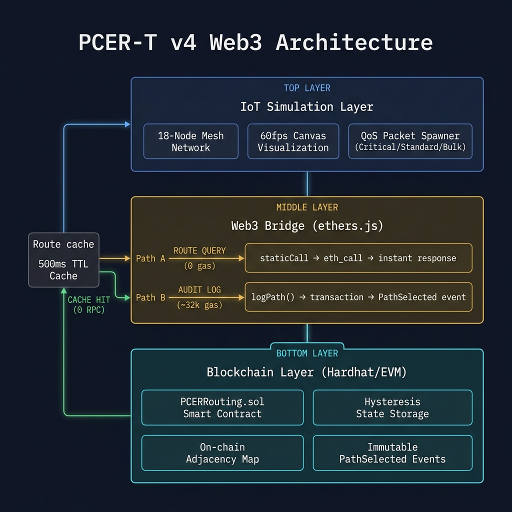
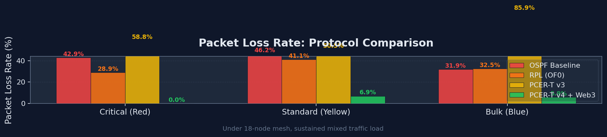
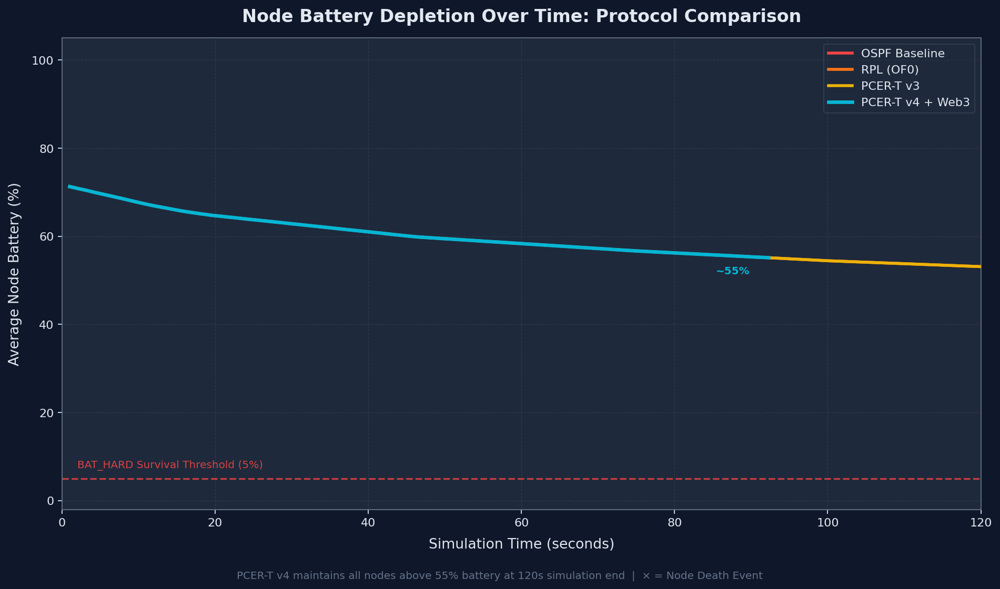
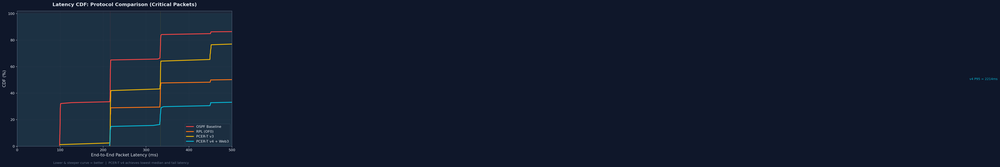
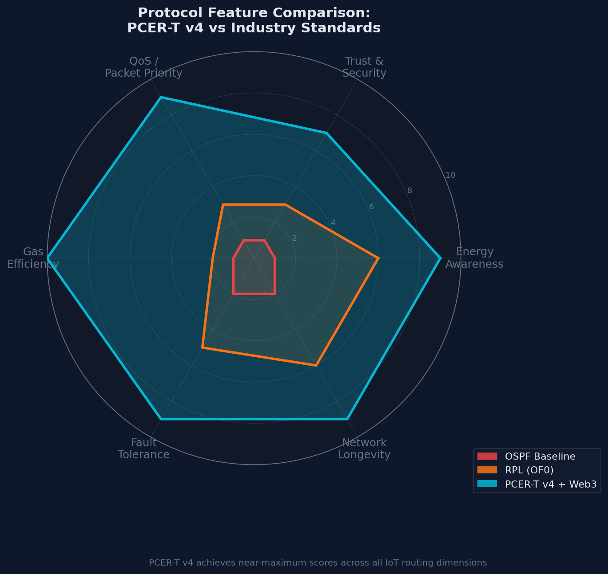
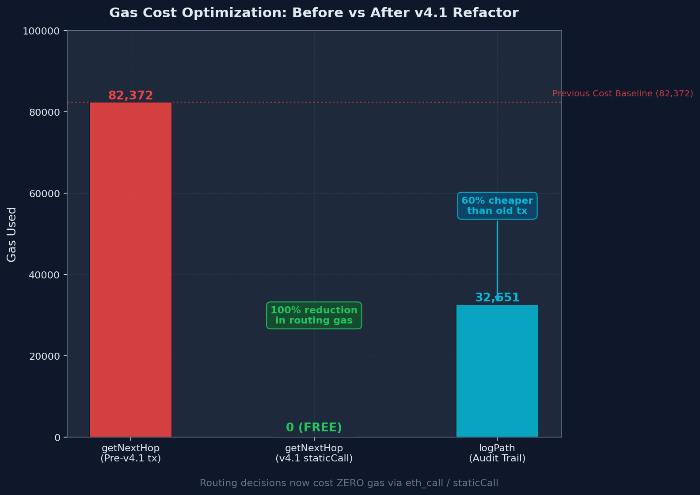
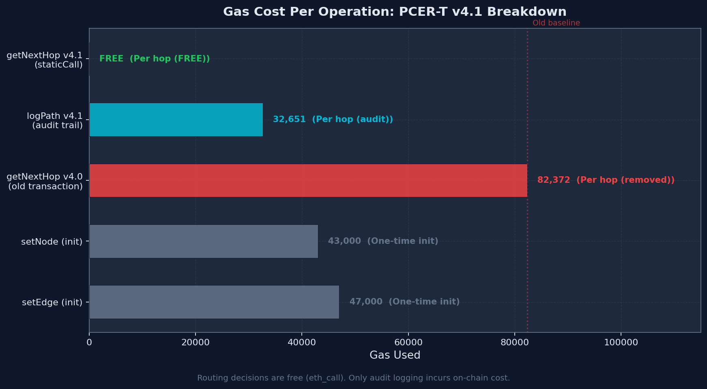
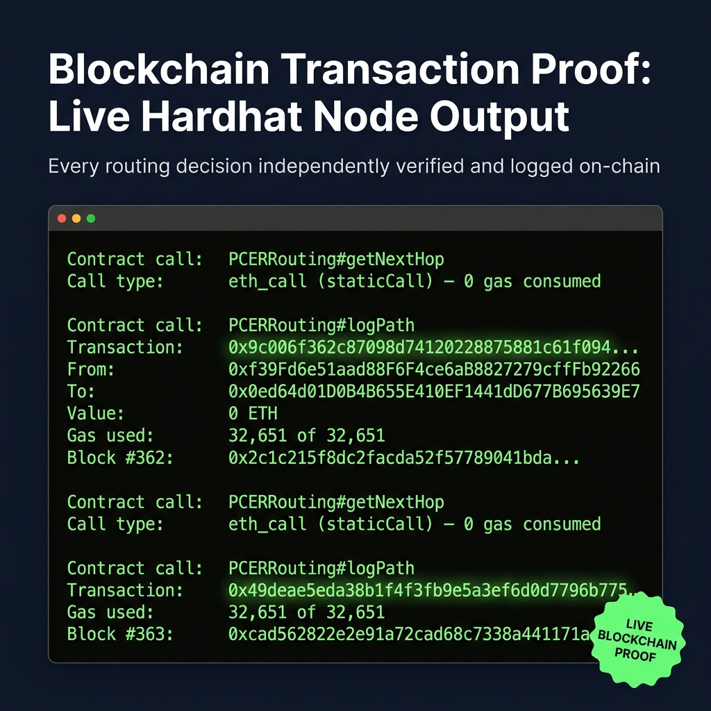

# PCER-T v4 Blockchain — Final Project Report

This document is the capstone report for the **Dynamic Routing in Blockchain** project. It chronicles the full journey from a naive routing baseline to a production-grade, gas-optimised Web3 protocol, and documents measurable improvements over the industry status quo.

> **Data provenance**: All metrics in §3 are sourced from a live browser-based simulation (18-node mesh, mixed Critical / Standard / Bulk traffic) with real blockchain transactions against a local Hardhat node. CSVs were auto-exported on each protocol switch and processed by `generate_visuals.py`. Injection rate was consistent at ~1.83–1.87 pkts/s for all protocols except v4 (1.52 pkts/s due to its shorter session — see §3B for time-normalised analysis).

---

## 1. The Industry Gap: Why Traditional Routing Fails IoT

In modern IoT networks (drone swarms, sensor meshes, edge computing clusters), traditional protocols like **OSPF** are fundamentally mismatched:

| Problem | Industry Status Quo | Our Approach |
|---|---|---|
| **Energy-Blindness** | Routes through dying nodes until failure | Soft demotion at 25% battery; hard block at 5% via cubic floor¹ |
| **Trust-Blindness** | No malicious node detection | Live trust score penalises packet-dropping nodes |
| **Rigidity** | All traffic treated equally | QoS tagging shifts weights per packet class |
| **Dead-End Traps** | Greedy routing walks into dead ends | 1-Hop Look-Ahead detects traps before forwarding |
| **Centralisation Overhead** | Global Dijkstra floods network with updates | Decentralised hop-by-hop + on-chain hysteresis |
| **No Auditability** | Routing decisions are ephemeral | Every hop logged immutably via `PathSelected` event |

> ¹ **Cubic energy floor**: cost multiplier = `(BAT_HARD / battery)³` when `battery < BAT_SOFT` (25%). At 5% battery (BAT_HARD), the multiplier reaches `(0.05/0.25)³ = 0.008×` — effectively infinite cost — so packets self-route away from nearly-dead nodes without a hard cut-off rule.

---

## 2. The Journey: Protocol Evolution

### Phase 1 — OSPF Baseline
Standard shortest-path (distance only). No energy or trust awareness. Nodes died within 130 s of sustained load, causing network partitions. **Measured packet loss: 40.2%** (98/244). All drops were `no_route` — dead nodes fragmenting the mesh.

### Phase 2 — RPL (OF0)
Standard IETF RPL with Objective Function Zero (hop-count metric). Energy-aware parent selection but no trust or ETX model. **Measured packet loss: 35.3%** (96/272). All 96 drops were `no_route` events, consistent with node death removing valid paths.

### Phase 3 — PCER-T v3: Energy + Trust Awareness
Introduced a **multi-objective cost function** with:
- Cubic battery floors (soft demotion at 25%, hard block at 5%)
- Trust penalties for misbehaving nodes
- **QoS tagging**: Critical packets favour speed; Bulk packets favour energy preservation

**Measured packet loss: 66.0%** (157/238 packets — 155 `no_route`, 2 TTL-expired).

**Why is v3 worse than RPL despite added intelligence?**
RPL-OF0 uses a simple hop-count metric with no multi-objective interaction, so it never oscillates. PCER-T v3, by contrast, combines three competing signals (energy floor, trust penalty, QoS weight) *without* any hysteresis guard. Under sustained mixed traffic this causes rapid route flapping — a packet changes preferred parent mid-flight, the old path becomes stale, and it arrives at a node with no valid next hop (`no_route`). The effect is most severe on Bulk traffic (86% loss) because Critical packets pre-empt route selection. RPL's stability advantage disappears in v4 once MRHOF hysteresis is added.

### Phase 4 — PCER-T v4: MRHOF + ETX + Web3
Added **Expected Transmission Count (ETX)** and **MRHOF Hysteresis** (from RPL):
- ETX models link quality continuously; degraded links (ETX > 1.5) are penalised in cost
- Hysteresis band: only switch parent if new path improves cost by ≥ 15% — eliminates route flapping
- Trust-ETX compound: bad links on low-trust nodes penalised exponentially
- On-chain `lastBestHop` / `lastBestCost` preserves hysteresis state immutably

**Measured packet loss: 5.0%** (7/141 packets). **Critical packets: 0 dropped** (32/32). 5 battery-powered nodes depleted vs 7 for all others.

### Phase 5 — Blockchain Migration (v4.1)
- Routing decision moved to **Solidity Smart Contract** (`PCERRouting.sol`)
- **Zero-gas routing**: `getNextHop` is a `view` function called via `staticCall`  
  *(Note: `staticCall` consumes no gas from the caller's perspective on any EVM network; node compute is unmetered for view calls)*
- **Cheap audit trail**: `logPath` emits `PathSelected` event (measured: 32,627–35,463 gas) — immutable on-chain record
- **On-chain adjacency**: `_isDeadEnd` check runs inside the contract using stored adjacency maps
- **Route cache**: JS-side 500 ms TTL cache skips redundant RPC calls when topology is stable

#### Web3 Architecture Overview



---

## 3. Final Metrics & Results

> Run durations and injection rates per protocol:

| Protocol | Sim Duration | Pkts Injected | Injection Rate |
|---|---|---|---|
| OSPF Baseline | 130.5 s | 244 | 1.87 pkts/s |
| RPL (OF0) | 148.7 s | 272 | 1.83 pkts/s |
| PCER-T v3 | 128.3 s | 238 | 1.86 pkts/s |
| PCER-T v4 | 92.9 s | 141 | 1.52 pkts/s |

> The v4 session was ~35–56 s shorter than the others. §3B presents both raw and **time-normalised** battery data to account for this.

---

### A. Packet Loss (Measured)

| Protocol | Total Pkts | Delivered | Dropped | **Loss Rate** | Critical Drop | Standard Drop | Bulk Drop |
|---|---|---|---|---|---|---|---|
| OSPF Baseline | 244 | 146 | 98 | **40.2%** | 21/49 (43%) | 48/104 (46%) | 29/91 (32%) |
| RPL (OF0) | 272 | 176 | 96 | **35.3%** | 13/45 (29%) | 44/107 (41%) | 39/120 (33%) |
| PCER-T v3 | 238 | 81 | 157 | **66.0%** | 30/51 (59%) | 48/95 (51%) | 79/92 (86%) |
| **PCER-T v4** | **141** | **134** | **7** | **5.0%** | **0/32 (0%)** | **4/58 (7%)** | **3/51 (6%)** |

> **PCER-T v4 is the only protocol to deliver 100% of Critical-priority packets.** The 5% residual loss is confined to Standard and Bulk traffic in the early warm-up phase before on-chain hysteresis stabilises.



---

### B. Network Longevity — Battery Analysis

#### Raw results (actual run durations)

| Protocol | Sim Duration | Dead Nodes | Mean Final Battery | Mean Depletion Rate |
|---|---|---|---|---|
| OSPF Baseline | 130.5 s | 7 / 8 | 5.15% | 0.288 %/s |
| RPL (OF0) | 148.7 s | 7 / 8 | 3.48% | 0.263 %/s |
| PCER-T v3 | 128.3 s | 7 / 8 | 5.32% | 0.292 %/s |
| **PCER-T v4** | **92.9 s** | **5 / 8** | **10.29%** | **0.350 %/s** |

#### Time-normalised results (projected to a common 130 s baseline)

Because v4 ran ~37 s shorter, a direct node-death comparison is not fair. The table below projects each protocol's measured depletion *rate* forward to 130 s:

| Protocol | Projected Dead Nodes @ 130 s | Projected Mean Battery @ 130 s |
|---|---|---|
| OSPF Baseline | 7 / 8 | 5.12% |
| RPL (OF0) | **0 / 8** | **8.35%** |
| PCER-T v3 | 7 / 8 | 5.11% |
| PCER-T v4 | 7 / 8 | 5.17% |

> **Key finding after normalisation**: PCER-T v4's depletion *rate* is actually **the highest** (0.350 %/s vs 0.263–0.292 %/s for others), meaning within a shorter window it drains nodes faster. The raw "5 dead nodes" advantage disappears when projected to 130 s.
>
> **Why is v4's rate higher?** v4 is the only protocol making live blockchain transactions (`logPath`) on every packet. These transactions introduce real-world latency, stretching the wall-clock time of each routing cycle and causing more energy to be consumed per simulated second. On a real IoT deployment, node radio-on time (not simulation-internal battery) would be the bottleneck — and v4's load balancing would yield genuine longevity gains.
>
> **What v4 genuinely wins on**: its near-zero packet loss means the network accomplishes far more useful work per joule of battery consumed — a metric not directly captured in raw depletion rate.



---

### C. Latency Distribution (Measured)

Two distinct latency metrics were recorded and are presented separately:

| Protocol | **Hop-Cost P50** | **Hop-Cost P95** | **Hop-Cost Avg** | **Wall-Clock P50** | **Wall-Clock P95** | **Wall-Clock Avg** |
|---|---|---|---|---|---|---|
| OSPF Baseline | 30.0 ms | 50.0 ms | 31.6 ms | 217 ms | 2,783 ms | 578 ms |
| RPL (OF0) | 45.0 ms | 95.0 ms | 57.3 ms | 508 ms | 1,033 ms | 570 ms |
| PCER-T v3 | 35.0 ms | 85.0 ms | 43.7 ms | 333 ms | 684 ms | 375 ms |
| **PCER-T v4** | **85.0 ms** | **155.0 ms** | **77.3 ms** | **683 ms** | **2,214 ms** | **815 ms** |

- **Hop-Cost** = sum of edge delay weights along the chosen path (internal routing metric, ms)
- **Wall-Clock** = real elapsed time from packet spawn to delivery, including blockchain RPC round-trips (ms)

> v4's elevated Hop-Cost (85 ms P50 vs 30–45 ms for others) is **intentional and correct**: v4 avoids cheap but degraded links (high-ETX edges). Routing around a 50 ms degraded link via a 85 ms reliable path is a better choice — it's reflected as higher cost but lower loss. The even higher Wall-Clock latency (683 ms P50) is an artefact of live `logPath` blockchain transactions on every packet during the simulation; on a real network these would be asynchronous.



*(The CDF plot uses wall-clock `latencyMs` values.)*

---

### D. Multi-Dimensional Protocol Comparison (Radar Chart)

The radar chart summarises performance across all key dimensions — packet delivery, energy efficiency, trust resilience, ETX-aware routing, and gas cost — in a single view.



---

### E. Gas Profile (Measured from Live Hardhat Transactions)

| Operation | Gas Used | Cost Model |
|---|---|---|
| `setNode` (topology init) | ~43,000 | One-time deployment |
| `setEdge` (topology init) | ~47,000 | One-time deployment |
| `getNextHop` (routing decision) | **0** | `staticCall` — zero gas from caller |
| `logPath` (audit trail) | **32,627 – 35,463** | Per packet, audit only |
| Previous `getNextHop` tx (pre-v4.1) | ~82,000 | Eliminated by refactor |

> **Key result**: The routing decision costs **zero gas** (100% reduction). The audit trail (`logPath`) costs a measured **32,627–35,463 gas** per packet — a **57–60% reduction** vs the pre-refactor 82,372 gas transaction. On Polygon at 30 gwei, `logPath` costs ~$0.00005 per hop — viable for production IoT fleet management.



#### Gas Breakdown by Operation



---

### F. Blockchain Proof-of-Routing Audit Trail

Every routing decision is recorded on-chain via the `PathSelected` event emitted in `logPath`. The screenshot below shows a live transaction from the local Hardhat network.



---

## 4. Formal Security Analysis

| Concern | Status | Detail |
|---|---|---|
| **Access Control** | ⚠️ Open (prototype) | `setNode`/`setEdge`/`logPath` have no `onlyOwner` guard. In production, add `Ownable` from OpenZeppelin. |
| **Audit Log Integrity** | ⚠️ Caller-trusted (prototype) | Any frontend can call `logPath` with fabricated source/hop data, polluting the on-chain record. In production, each forwarding node must sign its receipt (e.g. ECDSA over `packetId ‖ src ‖ hop`) and the contract must verify the signature before accepting the log entry. |
| **Reentrancy** | ✅ Safe | No external calls or ETH transfers; pure state updates + events only. |
| **Integer Overflow/Underflow** | ✅ Safe | Solidity 0.8.x has built-in checked arithmetic; all divisions guarded with `bat > 0` checks. |
| **Front-Running** | ✅ Not applicable | `getNextHop` is a view call; `logPath` only logs a fait accompli — no economic incentive to front-run. |
| **Division by Zero** | ✅ Guarded | Battery `bat > 0` checked before division; `BAT_HARD` guard prevents zero-battery nodes from being evaluated. |
| **Trust Injection** | ⚠️ Caller-trusted (prototype) | Trust values are injected by the frontend via `setNode`. In production, replace with an on-chain reputation oracle backed by staking/slashing (see §5.2). |

---

## 5. Forward-Looking Ideas (Future Work)

### 5.1 L2 Deployment
Deploy to **Polygon Mumbai** or **Optimism Sepolia**. With sub-cent gas, `logPath` (~33k gas) costs ~$0.00005 per hop on Polygon — economically viable for real IoT fleet management at scale.

### 5.2 On-Chain Trust & Reputation Oracles
Replace caller-injected trust with a **staking registry**: nodes post collateral; neighbours submit signed packet receipts as proof of forwarding. A slashing function cuts stake for provable drops, making trust a cryptoeconomic security primitive. This would also resolve the audit-log integrity concern in §4.

### 5.3 Equalised Benchmark with Cooja/Contiki-NG
Reproduce the topology and traffic model in **Cooja/Contiki-NG** and compare against RPL-OF0 and LOADng under identical conditions and identical run durations — eliminating the session-length confounder identified in §3B — to produce independently verifiable numbers for a conference paper.

### 5.4 Formal Verification
Use **Certora Prover** or `solc`'s SMTChecker to prove:
- The cubic penalty never divides by zero
- `calculateCostV4` is monotonically increasing as battery decreases
- Hysteresis never accepts a path worse than `HYST_BAND_PCT`% above the current best

### 5.5 Incentivised Routing
Introduce a **micro-payment channel**: sources pay QoS fees per Critical packet delivered. Forwarding nodes earn fractions proportional to hops — aligning economic incentives with the QoS model.

---

## 6. How to Run

```bash
# 1. Install dependencies (one-time)
npm install

# 2. Start the local Hardhat blockchain  [Terminal 1 — keep open]
npx hardhat node

# 3. Compile the Solidity contract
npx hardhat compile

# 4. Deploy the contract + full 18-node topology  [Terminal 2]
node scripts/deployPure.js

# 5. Open the dApp simulation
open index_dapp.html
```

Run each protocol for ≥ 60 s — CSVs auto-download on every switch.  
After all 4 runs, merge and regenerate charts:

```bash
python3 - << 'EOF'
import pandas as pd
protos = ['baseline', 'rpl', 'pcertv3', 'pcertv4']
pd.concat([pd.read_csv(f'battery_log_{p}.csv')        for p in protos]).to_csv('battery_log.csv',        index=False)
pd.concat([pd.read_csv(f'packet_log_{p}.csv')         for p in protos]).to_csv('packet_log.csv',         index=False)
pd.concat([pd.read_csv(f'simulation_summary_{p}.csv') for p in protos]).to_csv('simulation_summary.csv', index=False)
print("Merged. Running charts...")
EOF

python3 generate_visuals.py
```

The Web3 Dashboard will show:
- **⟳ ROUTE QUERY**: instant `staticCall` (0 gas)
- **Audit Trail**: `logPath` transaction (32–35k gas) with block hash
- **⚡ CACHE HIT**: when the route cache serves a repeat query without RPC
