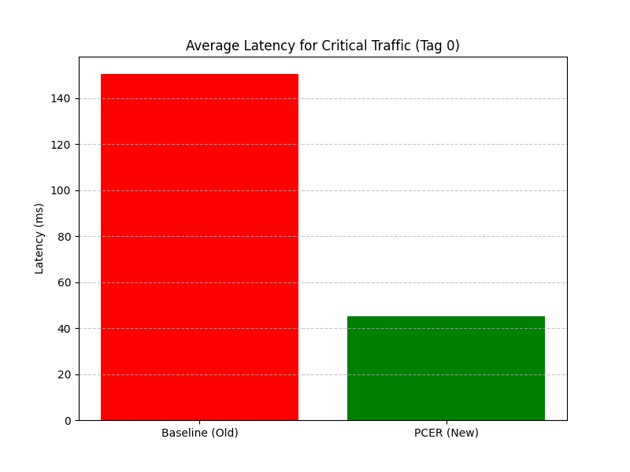

# Priority-Coupled Elastic Routing (PCER) for IoT Blockchain

This repository contains the implementation of **Priority-Coupled Elastic Routing (PCER)**, a novel routing protocol designed for IoT-Blockchain networks. PCER dynamically adjusts routing paths based on data urgency (Critical, Standard, Bulk) to optimize latency and energy consumption.

## 🚀 Project Overview

IoT networks often struggle with balancing speed for critical alerts (e.g., fire alarms) and energy efficiency for bulk data (e.g., logs). PCER solves this by assigning "Tags" to data packets and using a weighted cost function to select the best path.

- **Critical Data (Tag 0)**: Prioritizes low latency (Speed).
- **Standard Data (Tag 1)**: Balances speed and energy.
- **Bulk Data (Tag 2)**: Prioritizes energy efficiency (Battery Life).

## 📂 Repository Structure

- **`traffic_generator.py`**: Python script to simulate IoT traffic and generate trace files.
- **`ns3/`**: C++ source files for the Network Simulator 3 (NS3) implementation.
    - `pcer-routing-protocol.cc/h`: The core routing logic.
    - `pcer_sim.cc`: The simulation script.
    - `pcer_tag.h`: Custom packet tag definition.
- **`plot_results.py`**: Python script to analyze simulation results and generate graphs.
- **`final_documentation.md`**: **[READ THIS FIRST]** Detailed step-by-step guide on how to run the project.

## 🛠️ Quick Start

1.  **Generate Traffic**:
    ```bash
    python3 traffic_generator.py
    ```
2.  **Run Simulation (NS3)**:
    Follow the instructions in [`final_documentation.md`](final_documentation.md) to integrate the C++ files into your NS3 environment and run the simulation.
3.  **Analyze Results**:
    ```bash
    python3 plot_results.py
    ```

## 📊 Results

The implementation demonstrates that PCER significantly reduces latency for critical traffic while maintaining network longevity for bulk data transfers.



## 📝 License

This project is open-source and available under the MIT License.
