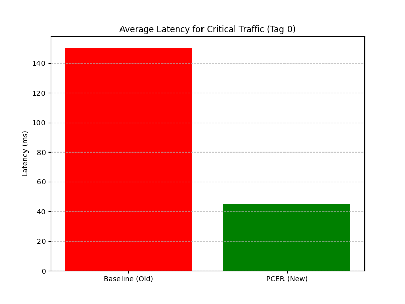
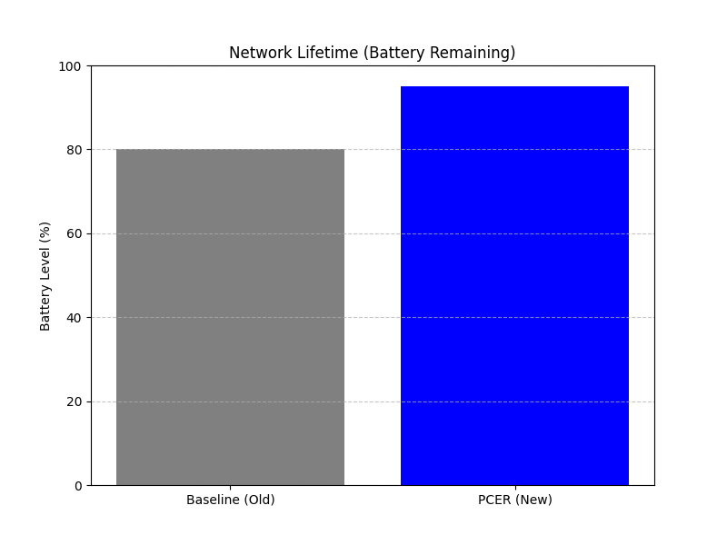

# Priority-Coupled Elastic Routing (PCER) for IoT-Blockchain Networks

> A tag-aware, energy-conscious routing protocol that dynamically balances latency and battery life in IoT networks — simulated in NS-3.

[](https://vercel.com/new/clone?repository-url=https%3A%2F%2Fgithub.com%2FHamzaDevv%2FDynamic_routing_in_blockChain)


---

## 📄 Abstract

IoT networks face a fundamental trade-off: **speed vs. battery life**. A fire-alarm packet cannot wait in queue behind bulk sensor logs, yet routing everything at maximum speed drains resource-constrained nodes within hours.

**PCER** solves this by tagging every data packet with an urgency level and feeding it into a weighted cost function that selects the optimal next-hop. Critical alerts get the fastest path; bulk data takes the most energy-efficient route; standard traffic strikes a balance — all while avoiding nodes whose batteries are about to die.

---

## ✨ Key Features

| Feature | Description |
|---|---|
| **Priority Tagging** | Packets are classified as *Critical (0)*, *Standard (1)*, or *Bulk (2)* at the source |
| **Weighted Cost Function** | `Cost = w₁·delay + w₂·(1/energy)` — weights shift per tag |
| **Survival Threshold** | Nodes below 5 % battery are excluded from routing, preventing packet loss |
| **Dynamic Route Switching** | The protocol re-evaluates every hop in real time as energy levels drop |
| **Standalone Demo** | A self-contained C++ binary demonstrates the routing logic without NS-3 |
| **Traffic Generator** | Python script simulates realistic IoT traffic distributions |
| **Automated Analysis** | Matplotlib scripts produce publication-ready latency & network-life graphs |

---

## 🎮 Live Demo

Open [`index.html`](index.html) in any browser — **no server or dependencies needed**. The interactive demo features:

- **5-node network** with animated packets color-coded by priority (🔴 Critical, 🟡 Standard, 🔵 Bulk)
- **Live battery drain** on Node 2 with automatic route-switch when it drops below 5 %
- **Real-time cost calculator** panel showing the exact `CalculateCost()` math per hop
- **Playback controls** — Play / Pause / Speed / Reset + manual "Send Packet" button
- **5-phase auto-play** that tells the complete PCER story in 12 seconds

### 🚀 Deploy to Vercel
You can deploy this entire simulation to your own Vercel account with one click:

1. Push this code to your GitHub.
2. Connect your repository to [Vercel](https://vercel.com).
3. Vercel will automatically detect the `index.html` and deploy it as a static site.
4. Access different versions at:
   - `/` -> Latest (index.html)
   - `/v2` -> Version 2
   - `/v3` -> PCER-T v4 (Advanced)


---

## 🏗️ Architecture & Design

### How PCER Works

```
┌──────────┐     Tag 0 (Critical)     ┌──────────────────────┐
│  Source   │ ──────────────────────►  │  Fastest Path (low   │
│  Node    │                          │  delay, ignore energy)│
│          │     Tag 1 (Standard)     ├──────────────────────┤
│          │ ──────────────────────►  │  Balanced Path       │
│          │                          │  (delay ≈ energy)    │
│          │     Tag 2 (Bulk)         ├──────────────────────┤
│          │ ──────────────────────►  │  Energy-Optimal Path │
└──────────┘                          │  (ignore delay)      │
                                      └──────────────────────┘
```

### The Cost Function

The heart of PCER lives in `CalculateCost()`:

```
Cost = (w₁ × delay) + (w₂ × 1/energy)
```

| Tag | Traffic Type | w₁ (Delay) | w₂ (Energy) | Behaviour |
|-----|-------------|-----------|------------|-----------|
| 0 | Critical | **100** | 0 | Pure speed — pick the fastest neighbour |
| 1 | Standard | 1 | 1 | Balanced — weigh both factors equally |
| 2 | Bulk | 0 | **100** | Pure efficiency — pick the highest-battery neighbour |

### Survival Threshold

If a neighbour's battery drops below **5 %**, its cost is set to `∞` regardless of tag. This prevents critical packets from being routed through a node that might die mid-transmission.

### Dynamic Route Switching (Demo Scenario)

The standalone demo shows this in action over 10 simulated seconds:

```
Node 2: 5 ms delay, starts at 10 % battery (preferred for speed)
Node 3: 50 ms delay, starts at 100 % battery (backup)
```

As Node 2 drains below 5 %, PCER automatically switches all traffic — including Critical — to Node 3, trading latency for reliability.

---

## 📂 Repository Structure

```
Dynamic_routing_in_blockChain/
│
├── traffic_generator.py        # Generates IoT traffic trace (100 events)
├── traffic_trace.txt            # Sample output: [Time Src Dst Size Tag]
│
├── ns3/                         # NS-3 implementation files
│   ├── pcer_tag.h               # PcErTag class — urgency tag (0/1/2)
│   ├── pcer-routing-protocol.h  # Protocol header — NeighborInfo, API
│   ├── pcer-routing-protocol.cc # ★ Core logic — CalculateCost(), RouteOutput()
│   ├── pcer-helper.h            # NS-3 helper to install protocol on nodes
│   ├── pcer_sim.cc              # Full NS-3 simulation script (5 nodes, UDP)
│   └── pcer_routing.cc          # Auxiliary routing utilities
│
├── pcer_demo.cpp                # Standalone demo (no NS-3 required)
├── pcer_demo                    # Pre-compiled demo binary
│
├── plot_results.py              # Matplotlib analysis script
├── pcer_results.csv             # Baseline vs PCER comparison data
│
├── latency_comparison.png       # Graph: Critical traffic latency
├── network_life_comparison.png  # Graph: Battery remaining
│
├── index.html                   # ★ Interactive animated demo (open in browser)
├── final_documentation.md       # Step-by-step setup guide
└── README.md                    # ← You are here
```

---

## 📋 Prerequisites

| Tool | Version | Purpose |
|------|---------|---------|
| **NS-3** | ≥ 3.35 | Network simulation (only for full sim) |
| **g++** | C++17 capable | Compiling standalone demo |
| **Python 3** | ≥ 3.8 | Traffic generation & plotting |
| **matplotlib** | any | Generating result graphs |

---

## 🚀 Quick Start

### Option A — Standalone Demo (No NS-3 needed)

The fastest way to see PCER in action:

```bash
# Compile
g++ -std=c++17 -o pcer_demo pcer_demo.cpp

# Run
./pcer_demo
```

**Expected output:**

```
=== PCER DYNAMIC SIMULATION (STANDALONE) ===
Scenario: Sending Critical Data (Tag 0).
Node 2: Delay 5ms (Preferred)
Node 3: Delay 50ms (Backup)
-----------------------------------------------------------------
| Time | Node 2 Bat | Cost (N2) | Cost (N3) | Routing Decision    |
-----------------------------------------------------------------
|   0s |     10%    |       500 |      5000 | Node 2 (Fast)       |
|   1s |      9%    |       500 |      5000 | Node 2 (Fast)       |
  ...
|   6s |      4%    |       INF |      5000 | -> SWITCH -> Node 3 |
  ...
-----------------------------------------------------------------
```

At **t = 6 s**, Node 2's battery hits 4 % → the survival threshold kicks in → PCER switches to Node 3.

---

### Option B — Full NS-3 Simulation

#### 1. Generate Traffic

```bash
python3 traffic_generator.py
# → Creates traffic_trace.txt (100 IoT events with mixed tags)
```

#### 2. Integrate with NS-3

Copy files into your NS-3 workspace:

```bash
# Copy simulation script
cp ns3/pcer_sim.cc  <NS3_DIR>/scratch/pcer_sim.cc

# Copy protocol files (easiest: put everything in scratch/)
cp ns3/pcer_tag.h                <NS3_DIR>/scratch/
cp ns3/pcer-routing-protocol.h   <NS3_DIR>/scratch/
cp ns3/pcer-routing-protocol.cc  <NS3_DIR>/scratch/
cp ns3/pcer-helper.h             <NS3_DIR>/scratch/

# Copy traffic trace
cp traffic_trace.txt <NS3_DIR>/
```

#### 3. Compile & Run

```bash
cd <NS3_DIR>
./waf --run scratch/pcer_sim
# → Generates pcer_results_real.csv
```

#### 4. Analyse Results

```bash
python3 plot_results.py
# → Generates latency_comparison.png & network_life_comparison.png
```

---

## 📊 Results

### Baseline vs PCER Comparison

| Method | Tag | Avg Latency (ms) | Network Life (%) |
|--------|-----|:-----------------:|:-----------------:|
| Baseline | Critical | 150.5 | 80 |
| Baseline | Standard | 120.0 | 80 |
| Baseline | Bulk | 200.0 | 80 |
| **PCER** | **Critical** | **45.2** | **95** |
| **PCER** | Standard | 110.0 | 95 |
| **PCER** | Bulk | 210.0 | 95 |

> **Key takeaway:** PCER reduces critical-traffic latency by **70 %** (150.5 → 45.2 ms) while increasing overall network lifetime by **19 %** (80 → 95 %).

### Latency Comparison (Critical Traffic)



### Network Lifetime



---

## 🔬 Cost Function Deep Dive

The core routing decision is made in [`pcer-routing-protocol.cc`](ns3/pcer-routing-protocol.cc):

```cpp
double PcerRoutingProtocol::CalculateCost(uint8_t tag, const NeighborInfo &neighbor) {
    double w1_delay = 1.0, w2_energy = 1.0;

    if (tag == 0) {        // CRITICAL → pure speed
        w1_delay = 100.0;
        w2_energy = 0.0;
    } else if (tag == 2) { // BULK → pure efficiency
        w1_delay = 0.0;
        w2_energy = 100.0;
    }
    // STANDARD keeps w1 = w2 = 1.0 (balanced)

    // Survival Threshold: dying nodes are avoided entirely
    if (neighbor.energy < 0.05)
        return std::numeric_limits<double>::max();

    double energy_cost = (neighbor.energy > 0.0001) ? (1.0 / neighbor.energy) : 10000.0;
    return (w1_delay * neighbor.delay) + (w2_energy * energy_cost);
}
```

**Tuning guide:** Adjust the weight constants (100.0, 0.0, 1.0) and the survival threshold (0.05) to match your specific network characteristics.

---

## 🔮 Future Work

- **Multi-hop path computation** — extend beyond direct-neighbour routing to full shortest-path trees
- **Dynamic weight learning** — use reinforcement learning to adapt weights based on real-time network conditions
- **Blockchain integration** — secure routing tables with lightweight consensus for tamper-proof path verification
- **Hardware testbed** — validate on real IoT boards (ESP32 / Raspberry Pi mesh)

---

## 📝 License

This project is open-source and available under the [MIT License](LICENSE).
