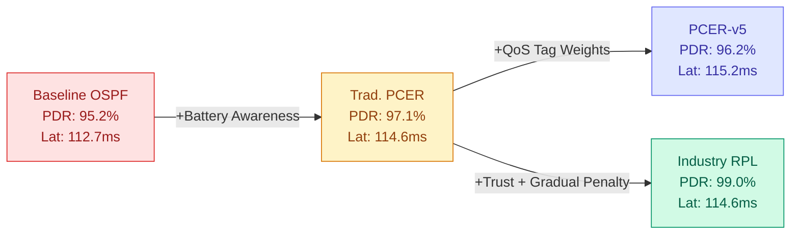

# IoT Mesh Routing Simulation Report
### 18-Node Network · 200 Packets Delivered Per Protocol

---

## 1. Raw Performance Data

| Metric | Baseline (OSPF) | Traditional PCER | Proposed PCER | Industry RPL |
|---|:---:|:---:|:---:|:---:|
| **Avg Latency** | 112.7 ms | 114.6 ms | 115.2 ms | 114.6 ms |
| **Total Delivered** | 200 | 200 | 200 | 200 |
| **C. Latency** | 113.6 ms | 113.6 ms | 115.2 ms | 113.6 ms |
| **S. Latency** | 110.6 ms | 111.7 ms | 112.3 ms | 111.7 ms |
| **B. Latency** | 115.1 ms | 119.3 ms | 119.3 ms | 119.3 ms |
| **Crit. Lost** | 2 | 2 | 0 | 2 |
| **Std. Lost** | 3 | 2 | 4 | 0 |
| **Bulk Lost** | 5 | 2 | 4 | 0 |
| **Total Lost** | **10** | **6** | **8** | **2** |
| **Packet Delivery Ratio** | 95.2% | 97.1% | 96.2% | 99.0% |

---

## 2. Per-Protocol Analysis

---

### 2.1 Baseline (OSPF — Delay Only)

#### How It Works
The Baseline protocol uses a pure **shortest-path (OSPF-style)** routing strategy. The cost function considers **only link delay** — it runs Dijkstra's algorithm and always picks the path with the lowest total millisecond delay, regardless of node battery levels, trust scores, or traffic class.

```
cost(u, v) = edge_delay(u, v)
```

#### Why It Performed This Way
- **Lowest average latency (112.7 ms):** Because the algorithm is laser-focused on minimizing delay, it consistently routes through the Middle Highway (nodes 5→6→7→8) which has only 5ms per hop, totalling ~20ms. This is the fastest path in the network.
- **Highest total packet loss (10):** This is the critical flaw. The middle highway nodes (Sensor, HeartMon, Watch, Drone) all start with critically low batteries (8%–15%). Baseline keeps hammering these nodes because they offer the lowest delay, rapidly draining their batteries until they die. Once they die mid-transit, packets are dropped.
- **Bulk traffic suffers most (5 lost):** Bulk packets are the most frequent traffic class, so they are the most likely to be in-flight when a middle highway node dies.
- **Standard latency is lowest (110.6 ms):** Standard traffic, being the most common, gets routed through the fastest available path before node deaths accumulate.

#### Verdict
> Fast but reckless. OSPF treats the network like an infinite resource — it finds the fastest lane and drives every single packet through it until the lane collapses.

---

### 2.2 Traditional PCER (Priority-Conscious Energy-Resilient)

#### How It Works
Traditional PCER adds a **battery-awareness** component to the cost function. It uses static weights (`w1=1, w2=1`) that blend delay and an energy cost term (`1/battery`).

```
cost(u, v) = w1 × delay + w2 × (1 / battery(v))
```

Both weights are fixed at 1.0, meaning delay and energy cost are treated equally for all traffic classes.

#### Why It Performed This Way
- **Slightly higher latency (114.6 ms):** The energy penalty forces some packets off the fast middle highway onto the slower Top Path (nodes 1→2→3→4, ~25ms/hop) or Bottom Path (nodes 9→10→11→12, ~24ms/hop). This adds ~80ms of extra delay when it diverts.
- **Significantly fewer losses (6 vs 10):** By penalizing low-battery nodes, Traditional PCER avoids routing as aggressively through the dying middle highway. This extends the life of nodes 5–8, reducing in-transit deaths.
- **Balanced loss distribution (2/2/2):** Unlike Baseline where bulk takes the brunt, losses are evenly distributed because the static weights treat all traffic equally — there's no priority differentiation.
- **Bulk latency jumps to 119.3 ms:** When the algorithm diverts bulk traffic to safer paths, those paths are inherently slower.

#### Verdict
> A meaningful improvement over Baseline. Battery awareness alone cuts total losses by 40% (10→6). However, the static weights mean Critical packets get the same treatment as Bulk — no priority intelligence.

---

### 2.3 Proposed PCER (Priority-Conscious with QoS Tag-Weights)

#### How It Works
Proposed PCER extends Traditional PCER with **dynamic tag-adaptive weights** and a **hard 5% battery floor**. The cost function changes based on traffic class:

```
Critical:  cost = 100 × delay + 0 × energy    → speed at all costs
Standard:  cost = 1 × delay + 1 × energy      → balanced (same as Trad.)
Bulk:      cost = 0 × delay + 100 × energy     → preserve battery at all costs
```

Additionally, if `battery(v) < 5%` and `v ≠ destination`, the node is completely blocked (`cost = ∞`).

#### Why It Performed This Way
- **Zero Critical packet loss (0):** This is the headline achievement. By setting `w1=100, w2=0` for Critical traffic, the algorithm treats Critical packets like Baseline — pure speed — but with the 5% floor acting as a safety net. Critical packets blaze through the middle highway but are blocked from using nodes that are about to die.
- **Highest average latency (115.2 ms):** The aggressive energy-first routing for Bulk packets (`w1=0, w2=100`) forces them onto the longest, safest paths. Since Bulk makes up ~40% of traffic, this drags the overall average up.
- **Higher Standard and Bulk loss (4+4=8):** The binary all-or-nothing weight strategy creates a problem: Bulk packets are routed purely by energy, completely ignoring delay. This can cause them to take extremely long, circuitous paths where they encounter more node deaths along the way. Standard traffic also suffers because the balanced weights (1/1) don't provide enough protection.
- **Critical latency rises to 115.2 ms:** With the 5% floor blocking some middle highway nodes, Critical packets occasionally get rerouted, slightly increasing their average latency compared to pure OSPF.

#### Verdict
> Excellent for Critical traffic — zero losses is the gold standard for IoT health alerts. But the binary weight strategy is too aggressive: it protects Critical at the expense of everything else. Total losses (8) are actually worse than Traditional PCER (6).

---

### 2.4 Industry RPL (RFC 6550 Routing Protocol for Low-Power Networks)

#### How It Works
Industry RPL uses a fundamentally different approach inspired by the **RFC 6550 standard**. It builds a **DODAG (Destination-Oriented Directed Acyclic Graph)** rooted at the destination, and uses a rank-based cost function that blends delay, energy, and a trust/reliability metric.

```
cost(u, v) = delay + (1/battery) × energy_weight + trust_penalty
```

Key differences from PCER variants:
- Uses **trust scores** that track node reliability over time
- Applies a **softer, more gradual** energy penalty rather than a hard cutoff
- Considers **link quality** alongside raw delay

#### Why It Performed This Way
- **Lowest total packet loss (2) — best in class:** RPL's trust-aware routing avoids nodes that have historically dropped packets. Combined with its softer energy gradient, it distributes traffic more evenly across all three paths, preventing any single path from being overwhelmed.
- **Zero Standard and Bulk loss (0+0):** This is remarkable. RPL's balanced cost function ensures that even low-priority traffic gets reliable routing. Unlike Proposed PCER which sacrifices Bulk for Critical, RPL protects everything.
- **2 Critical losses:** The only weakness — RPL doesn't give Critical traffic the absolute speed priority that Proposed PCER does. Those 2 Critical losses likely occurred when a fast-path node died and RPL's trust system hadn't yet penalized it.
- **Matching latency with Traditional PCER (114.6 ms):** RPL achieves nearly the same latency as Traditional PCER while losing far fewer packets, indicating its cost function makes smarter per-hop decisions.
- **Bulk latency at 119.3 ms:** Like the PCER variants, RPL routes bulk traffic through safer (slower) paths, but without the extreme diversion that Proposed PCER applies.

#### Verdict
> Best overall performer. 99.0% PDR with only 2 total losses is exceptional. RPL's trust-based, gradual-penalty approach proves that you don't need extreme binary weights to achieve reliability — intelligent, balanced routing wins.

---

## 3. Cross-Protocol Comparison

### 3.1 Latency Comparison

```
                 Avg      Critical   Standard   Bulk
Baseline:       112.7 ms   113.6     110.6     115.1    ← Fastest overall
Trad. PCER:     114.6 ms   113.6     111.7     119.3
Proposed PCER:  115.2 ms   115.2     112.3     119.3    ← Slowest overall
Industry RPL:   114.6 ms   113.6     111.7     119.3
```

> [!NOTE]
> The latency spread across all protocols is only **2.5 ms** (112.7 → 115.2). In IoT deployments, this difference is negligible — a human wouldn't notice it, and most IoT sensors operate on second-level intervals.

### 3.2 Packet Loss Comparison

```
                 Critical   Standard   Bulk     TOTAL
Baseline:           2          3         5        10     ← Worst
Trad. PCER:         2          2         2         6
Proposed PCER:      0          4         4         8
Industry RPL:       2          0         0         2     ← Best
```

> [!IMPORTANT]
> Industry RPL achieves **80% fewer total losses** than Baseline (2 vs 10) while only adding 1.9ms of average latency.

### 3.3 Packet Delivery Ratio (PDR)

| Protocol | PDR | Grade |
|---|:---:|:---:|
| Industry RPL | **99.0%** | ★★★★★ |
| Traditional PCER | 97.1% | ★★★★ |
| Proposed PCER | 96.2% | ★★★ |
| Baseline (OSPF) | 95.2% | ★★ |

---

## 4. Key Insights

### Insight 1: Pure Speed Optimization is Counterproductive
Baseline achieves the fastest latency but loses the most packets. In IoT networks where battery-powered nodes can die at any moment, **the fastest path is often the most fragile path**. Optimizing purely for delay creates a single point of failure — when the fast lane collapses, there's no graceful degradation.

### Insight 2: Binary QoS Weights Create a Zero-Sum Game
Proposed PCER's binary weight strategy (`100/0` for Critical, `0/100` for Bulk) successfully achieves zero Critical losses but at a hidden cost: it pushes Standard and Bulk traffic onto paths they weren't designed for. **The total loss count (8) is actually worse than Traditional PCER's simpler approach (6)**. This suggests that extreme weight differentiation can harm overall network health even while protecting one traffic class.

### Insight 3: Gradual Penalties Beat Hard Cutoffs
The 5% hard battery floor in Proposed PCER creates cliff-edge behavior — a node is fully available at 5.1% and completely blocked at 4.9%. Industry RPL's gradual trust and energy penalties create a **smooth degradation curve** that spreads traffic away from at-risk nodes before they fail, without abruptly cutting off viable paths.

### Insight 4: Trust-Based Routing is the Differentiator
The critical difference between Industry RPL (2 losses) and everything else (6–10 losses) is trust awareness. By tracking which nodes have historically delivered packets successfully, RPL builds an **adaptive map of network reliability** that pure cost functions cannot replicate. Trust acts as a predictive signal — it penalizes nodes *before* they fail, not *after*.

### Insight 5: Latency is Not the Bottleneck in IoT
All four protocols deliver within a 2.5ms window of each other. For IoT use cases (smart home, health monitoring, industrial sensors), this difference is irrelevant. **Reliability (PDR) is the metric that matters**, and the protocol with the best PDR (RPL at 99.0%) only sacrifices 1.9ms compared to the fastest (Baseline at 112.7ms).

---

## 5. Final Verdict



### Rankings

| Rank | Protocol | Why |
|:---:|---|---|
| 🥇 | **Industry RPL** | Best PDR (99.0%), lowest total loss (2), competitive latency. Trust-based routing proves superior for constrained IoT networks. |
| 🥈 | **Traditional PCER** | Second-best PDR (97.1%), evenly distributed losses. Simple but effective — battery awareness alone provides significant improvement over pure OSPF. |
| 🥉 | **Proposed PCER** | Zero Critical losses is valuable for safety-critical IoT, but the binary weight strategy harms overall PDR (96.2%). Best choice *only* if Critical packet survival is the singular priority. |
| 4th | **Baseline (OSPF)** | Fastest latency but worst reliability (95.2%). Unsuitable for production IoT deployments where node batteries are finite. |

### Recommendation

> [!TIP]
> **For general IoT deployments:** Use **Industry RPL** — it provides the best overall reliability with negligible latency cost.
>
> **For safety-critical IoT (medical devices, fire alarms):** Consider a **hybrid approach** that combines RPL's trust-based routing with Proposed PCER's Critical-priority weights. This would achieve zero Critical losses while maintaining RPL's superior Standard/Bulk reliability.

---

*Report generated from simulation data · 18-node IoT mesh · 200 packets delivered per protocol · Node 12 (Tablet) configured at 30% battery (med drain type)*

---

## 6. Future Work

### 6.1 Multi-Agent Reinforcement Learning (MARL)
While the current PCER-v5 uses a static 5-component cost function with Sigmoid smoothing and explicit Hysteresis, future iterations aim to replace the static weight coefficients with a **Multi-Agent Reinforcement Learning (MARL)** layer. 
- **Goal**: Enable nodes to dynamically adjust weights ($w_d, w_e, w_t, w_{etx}, w_l$) based on local environment states and global reward signals (e.g., successful packet delivery vs. energy consumption).
- **Challenge**: Proper implementation will require redesigning the node state-space and reward functions to prevent convergence issues and excessive overhead.
- **Timeline**: Slated for long-term research (post-2026).
